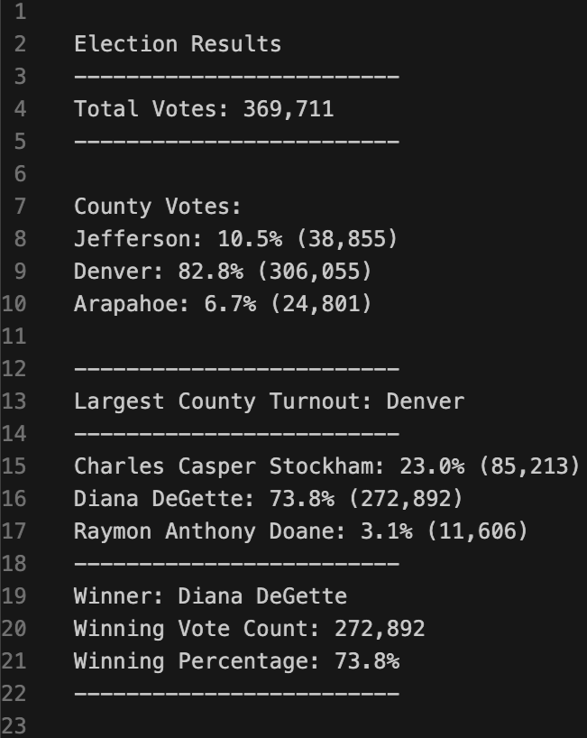

# Election Analysis with Python

## Overview of Project

* Tom, an employee for the Colorado Board of Elections, is looking to conduct an election audit for a US Congressional precinct in Colorado
* The following must be reported: total votes, vote count for each candidate, percentage of votes for each candidate, county data, and the winner of the election

### Purpose

* To report the results of the election
* To certify the winner of the US Congressional race 

## Election Results

### Image

* See Election Results: 

### Votes

* Total votes: 369,711
* Candidate votes
    - Charles Casper Stockham: 23.0% (85,213)
    - Diana DeGette: 73.8% (272,892)
    - Raymon Anthony Doane: 3.1% (11,606)

### County Data

* Largest turnout: Denver 
* Jefferson: 10.5% (38,855)
* Denver: 82.8% (306,055)
* Arapahoe: 6.7% (24,801)

### Winner 

* Winner: Diana DeGette
* 2nd Place: Charles Casper Stockham
* 3rd Place: Raymon Anythony Doane

## Summary - A Business Proposal to the Election Commission 

* While the PyPoll code successfully reports the winner of the election, along with county data, further updates to the code can deliver more election data for future elections. 

* Two potential modifications for future elections that would yield useful insight to the election analysis: 

1. Voter participation for each county. This would be implemented by (Number of Votes in the County) / (Number of Residents Able to Vote in the County). This information would show counties with high and low voter participation.

2. Political party affiliation for each candidate and voter. Another column in the data could show each candidates's political party affiliation. This data would be extracted in the following manner: candidate_party = row[3]. In addition, voters who are affiliated with a political party will be shown in another column. This data would be extracted similarly: voter_party = row[4]. This data will show how often voters voted in line with their political party. 
